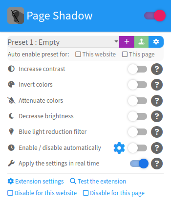

# Page Shadow :

## English :

An extension by Eliastik (eliastiksofts.com) - Contact : http://www.eliastiksofts.com/contact/
* Latest version: 2.0.3 (09/07/2017)
* Official website: http://eliastiksofts.com/page-shadow
* Github repository: https://github.com/Eliastik/page-shadow

This is the source code for the extension Page Shadow, compatible with Chrome/Chromium, Firefox, Opera and Microsoft Edge. This extension uses the WebExtensions technology via the Chrome API (more infos : https://developer.mozilla.org/fr/Add-ons/WebExtensions )

Page Shadow is an extension with a series of tools to improve the reading of web pages in badly lit room/other. It allows you to increase page contrast, decrease page brightness, invert image colors, or activate night mode (applies an orange filter on the page to reduce the blue light emitted by the screen).

### Installation:
Page Shadow is avalaible to download and install at the following addresses:

* Chrome : https://chrome.google.com/webstore/detail/eimaelgbclmdoeimifebaagealdkjmki/
* Firefox : https://addons.mozilla.org/fr/firefox/addon/page-shadow/
* Opera : https://addons.opera.com/fr/extensions/details/page-shadow/?display=fr

For the other compatibles browser, you can install this extension from the official website: http://eliastiksofts.com/page-shadow
Or you can compile yourself (see Compilation section).

### Changelog:

#### Version 2.0.3 (09/07/2017) :
* It is now possible to disable Page Shadow for a particular website or page via the right-click or via the extension menu
* Bug fixes and minor adjustments :
    - Themes 2 and 3 now have a gray background for transparent images
    - Added support for HTML form and caption elements by the Increase page contrast tool (improves rendering of the tool)
    - Fixed a bug with tool setting Decrease page brightness
    - The image on the test page of the extension now correctly resizes when the browser window is resized
    - Basic support for future versions of Firefox for Android (not tested)
    - Small adjustments of the code
    
#### Version 2.0.2 (17/06/2017) :
* The settings can now be applied in real time
* Fixed Page Shadow icon (the shadow is better)
* Bugs fixes :
    - Bug fixed with the manifest.json file (one manifest.json different for each browser have been created)
    - Bug fixed with the automatic reactivation of the tool Increase page contrast with some particular websites (such as Youtube)
    - Bug fixed with the Gulpfile (which allows the compilation of the extension). The extension can now be compiled for Edge and Opera
    - Other minor adjustements.

#### Version 2.0.1 (09/06/2017) :
* Microsoft Edge support
* Performance improvements and bugs fixes :
    - Switched to chrome.storage API instead of localstorage
    - Removed Jquery dependency for Content Scripts
    - Fixed bug with browser language detection : the form field in the advanced settings remained blank in certains cases
    - Fixed bug with the Increase page contrast tool with some websites (such as Youtube)
    - Other minor adjustements.

#### Version 2.0 (05/06/2017) :
* Firefox support
* New graphical theme based on Bootstrap
* Integrated translation engine and added English translation
* Added color themes for the "Increase contrast" tool
* Added night mode
* Added a mode to invert the color of the images
* Performance improvements
* Various fixes (bugs, texts)
    
#### Version 1.2.1 :
* Fixed bug in the advanced settings
* Adding informations about the extension in the advanced settings
    
#### Version 1.2 :
* Optimisation of the popup layout
* Improved function "Increase page contrast". The transparent images are now supported
* Some adjustements
    
#### Version 1.1 :
* Improved function "Increase page contrast"
    
#### Version 1.0 :
* Initial version
    
### Compilation :

You can compile yourself the extension with only one command line. To do this, you have to install npm and gulp.

To install npm for your OS, read this page: https://docs.npmjs.com/getting-started/installing-node

To install gulp with npm, run the following command:
````
npm i -g gulp
````
Git clone the repository and cd to the project directory (or download it directly from Github):
````
git clone https://github.com/Eliastik/page-shadow.git
cd page-shadow
````
The compilation need the following npm packages (which will be created in the project directory): gulp (local), gulp-clean, gulp-crx-pack, gulp-zip and run-sequence.

To install these packages, run the following command:
````
npm install
````
Then to compile:
````
gulp
````
The extension files compiled will be created in the sub-directory "build".

(Note: The key directory contains a key needed to compile the Chrome extension).

To install the extension in Firefox, you need to modify the following value in about:config to "false": xpinstall.signatures.required
Then launch the installation with the .xpi file.

For Chrome, slide the .crx file in the extension window (chrome://extensions).

### Licence :

Copyright (C) 2015-2017 Eliastik (eliastiksofts.com)

This program is free software: you can redistribute it and/or modify
it under the terms of the GNU General Public License as published by
the Free Software Foundation, either version 3 of the License, or
(at your option) any later version.

This program is distributed in the hope that it will be useful,
but WITHOUT ANY WARRANTY; without even the implied warranty of
MERCHANTABILITY or FITNESS FOR A PARTICULAR PURPOSE.  See the
GNU General Public License for more details.

You should have received a copy of the GNU General Public License
along with this program.  If not, see <http://www.gnu.org/licenses/>.

### Credits :

- Source Sans Pro (version 2.020), SIL Open Font License version 1.1 ( http://scripts.sil.org/OFL ) : https://github.com/adobe-fonts/source-sans-pro/blob/master/LICENSE.txt
- Font Awesome, SIL Open Font License version 1.1 ( http://scripts.sil.org/OFL )
- Jquery, MIT license ( https://tldrlegal.com/license/mit-license ) ;
- Bootstrap (CSS and Javascript), MIT license ( https://github.com/twbs/bootstrap/blob/v4-dev/LICENSE ) ;
    - Theme: Paper by Bootswatch (modified) - https://bootswatch.com/paper/
- i18next, MIT license ( https://github.com/i18next/i18next/blob/master/LICENSE ) ;
- Bootstrap Slider, MIT license ( https://github.com/seiyria/bootstrap-slider/blob/master/LICENSE.md ) ;
- This extension uses a picture from this site: http://littlevisuals.co , Public domain ( https://creativecommons.org/publicdomain/zero/1.0/ ).

## Français :

Une extension by Eliastik (eliastiksofts.com) - Contact : http://www.eliastiksofts.com/contact/
* Version actuelle : 2.0.3 (09/07/2017)
* Site officiel : http://eliastiksofts.com/page-shadow
* Dépôt Github : https://github.com/Eliastik/page-shadow

Ceci est le code source de l'extension Page Shadow, compatible avec Chrome/Chromium, Firefox, Opera et Microsoft Edge. Cette extension utilise la technologie WebExtensions via l'API Chrome (plus d'infos : https://developer.mozilla.org/fr/Add-ons/WebExtensions )

Page Shadow est une extension comprenant une série d'outils pour améliorer la lecture de pages web dans une pièce mal éclairée/autre. Elle vous permet d'augmenter le contraste de la page, de baisser la luminosité de la page, d'inverser les couleurs des images ou d'activer un mode nuit (applique un filtre orangé sur la page pour réduire la lumière bleue émise par l'écran).

### Installation :
Page Shadow est disponible au téléchargement et à l'installation aux adresses suivantes :

* Chrome : https://chrome.google.com/webstore/detail/eimaelgbclmdoeimifebaagealdkjmki/
* Firefox : https://addons.mozilla.org/fr/firefox/addon/page-shadow/
* Opera : https://addons.opera.com/fr/extensions/details/page-shadow/?display=fr

Pour les autres navigateurs compatibles, vous pouvez soit l'installer depuis le site officiel : http://eliastiksofts.com/page-shadow
Soit la compiler vous-même (voir section "Compilation").

### Journal des changements :

#### Version 2.0.3 (09/07/2017) :
* Il est désormais possible de désactiver Page Shadow pour un site ou une page particulière via le clic-droit ou via le menu de l'extension ;
* Corrections de bugs et ajustements mineurs :
    - Les thèmes 2 et 3 ont désormais un fond gris pour les images transparentes ;
    - Ajout de la prise en charge des éléments HTML form et caption par l'outil Augmenter le contraste (améliore le rendu de l'outil) ;
    - Correction d'un bug avec le réglage de l'outil Baisser la luminosité de la page ;
    - L'image de la page d'exemple de l'extension se redimensionne désormais correctement lorsque la fenêre du navigateur est redimensionnée ;
    - Prise en charge basique des versions futures de Firefox pour Android (non testé) ;
    - Petits ajustements du code.

#### Version 2.0.2 (17/06/2017) :
* Les paramètres peuvent désormais être appliqués en temps réel ;
* Correction de l'icône de Page Shadow (l'ombre est de meilleure qualité) ;
* Corrections de bugs :
    - Corrections de bugs avec le manifest.json (un manifest.json différent pour chaque navigateur a été créé) ;
    - Correction d'un bug avec la réactivation automatique de l'outil "Augmenter le contraste" avec certains sites particuliers (comme Youtube) ;
    - Corrections de bugs avec le fichier Gulp (qui permet la compilation de l'extension). L'extension peut désormais être compilée pour Edge et Opera ;
    - Autres petits ajustements.

#### Version 2.0.1 (09/06/2017) :
* Compatibilité Microsoft Edge ;
* Amélioration des performances et corrections de bugs :
    - Basculement de l'API localstorage vers l'API chrome.storage ;
    - Suppression de Jquery en tant que Content Script ;
    - Correction d'un bug avec la détection de la langue du navigateur : le champ dans les options avancées restait vide dans certains cas ;
    - Correction d'un bug de l'outil "Augmenter le contraste" avec certains sites (comme Youtube) ;
    - Autres petits ajustements.

#### Version 2.0 (05/06/2017) :
* Compatibilité Firefox ;
* Nouveau thème graphique basé sur Bootstrap ;
* Moteur de traduction intégré et ajout d'une traduction en anglais ;
* Ajout de thèmes de couleur pour l'outil "Augmenter le contraste" ;
* Ajout d'un mode nuit ;
* Ajout d'un mode permettant d'inverser la couleur des images ;
* Amélioration des performances ;
* Corrections diverses (bugs, textes).

#### Version 1.2.1 :
* Correction d'un bug dans les paramètres avancés ;
* Ajout d'informations sur l'application dans les paramètres avancés.

#### Version 1.2 :
* Optimisation de la mise en page de la popup ;
* Amélioration de l'outil "Augmenter le contraste". Les images transparentes sont désormais prises en charge ;
* Quelques ajustements.

#### Version 1.1 :
* Amélioration de la fonction "Augmenter le contraste".

#### Version 1.0 :
* Version initiale.

### Compilation :

Vous pouvez compiler vous-même l'extension en une ligne de commande. Pour cela, vous devez avoir installé npm et gulp.

Pour installer npm sur votre système, plus d'infos ici : https://docs.npmjs.com/getting-started/installing-node

Pour installer gulp avec npm, lancez la commande suivante :
````
npm i -g gulp
````
Faites un Git clone du dépôt et faites un cd vers le dossier du projet (ou bien téléchargez le directement depuis Github) :
````
git clone https://github.com/Eliastik/page-shadow.git
cd page-shadow
````
La compilation nécessite les paquets npm suivants (qui seront créés dans le dossier de ce projet) : gulp (local), gulp-clean, gulp-crx-pack, gulp-zip et run-sequence.

Pour les installer, lancez la commande suivante :
````
npm install
````
Puis pour compiler :
````
gulp
````
Les fichiers d'extension compilés seront créés dans le dossier "build".

(Note : le répertoire key contient une clé nécessaire à la création d'une extension Chrome).

Pour installer l'extension dans Firefox, vous devez modifier la valeur suivante dans about:config en "false" : xpinstall.signatures.required
Puis lancez l'installation avec le fichier .xpi

Pour Chrome, faites glisser le fichier .crx dans la fenêtre des extensions (chrome://extensions).

### Licence :

Copyright (C) 2015-2017 Eliastik (eliastiksofts.com)

Ce programme est un logiciel libre ; vous pouvez le redistribuer ou le
modifier suivant les termes de la GNU General Public License telle que
publiée par la Free Software Foundation ; soit la version 3 de la
licence, soit (à votre gré) toute version ultérieure.

Ce programme est distribué dans l'espoir qu'il sera utile,
mais SANS AUCUNE GARANTIE ; sans même la garantie tacite de
QUALITÉ MARCHANDE ou d'ADÉQUATION à UN BUT PARTICULIER.
Consultez la GNU General Public License pour plus de détails.

Vous devez avoir reçu une copie de la GNU General Public License en même temps
que ce programme ; si ce n'est pas le cas, consultez <http://www.gnu.org/licenses>.

### Credits :

- Source Sans Pro (version 2.020), SIL Open Font License version 1.1 ( http://scripts.sil.org/OFL ) : https://github.com/adobe-fonts/source-sans-pro/blob/master/LICENSE.txt
- Font Awesome, SIL Open Font License version 1.1 ( http://scripts.sil.org/OFL )
- Jquery, MIT license ( https://tldrlegal.com/license/mit-license ) ;
- Bootstrap (CSS et Javascript), MIT license ( https://github.com/twbs/bootstrap/blob/v4-dev/LICENSE ) ;
    - Thème : Paper par Bootswatch (modifié) - https://bootswatch.com/paper/
- i18next, MIT license ( https://github.com/i18next/i18next/blob/master/LICENSE ) ;
- Bootstrap Slider, MIT license ( https://github.com/seiyria/bootstrap-slider/blob/master/LICENSE.md ) ;
- Cette extension utilise une photo venant de ce site : http://littlevisuals.co , domaine public ( https://creativecommons.org/publicdomain/zero/1.0/ ).
